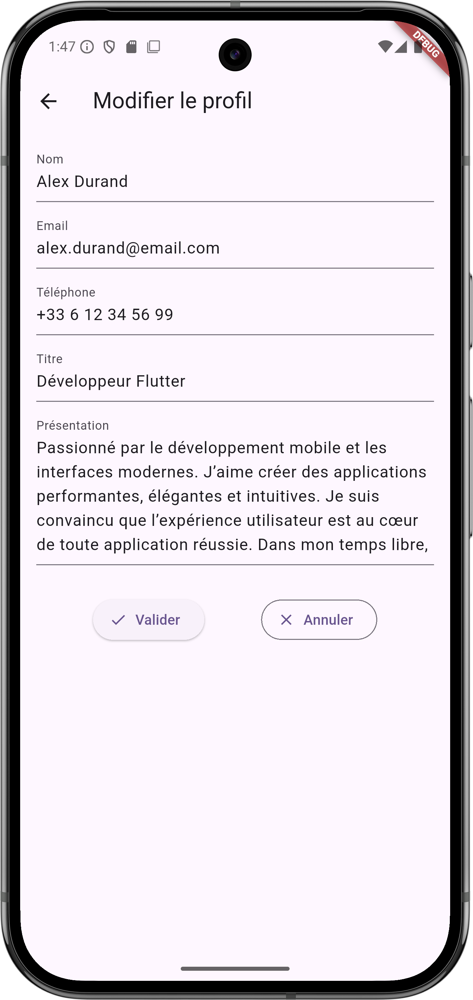

# Flutter Project – Menus et Navigation + Modification de Profil (Formulaire)

## Présentation

Ce projet Flutter est une application de démonstration qui montre :
- Comment créer des **menus** (`Drawer`, `BottomNavigationBar`) avec Flutter.
- Comment **naviguer** entre plusieurs pages (`Navigator.push`, `Navigator.pop`).
- Comment **passer des données entre pages** via **un objet `Utilisateur`**.
- Comment **modifier dynamiquement** les informations du profil avec un **formulaire** (`Form`, `TextFormField`) et récupérer les données.

Le projet sert de base pour explorer ensuite **la gestion des états** avec `Provider`.

## Fonctionnalités principales

- Page d'accueil avec menus Drawer et BottomNavigationBar
- Page de profil affichant :
    - Avatar
    - Nom
    - Email
    - Téléphone
    - Titre professionnel
    - Biographie
- Formulaire de modification du profil :
    - Validation des champs (ex : email non vide, nom obligatoire)
    - Passage d'un objet `Utilisateur` complet entre les pages
    - Retour du formulaire avec la mise à jour du profil en temps réel

## Technologies

- Flutter (>=3.0)
- Dart
- Material Design

## Arborescence simplifiée du projet

```
lib/
 ├── main.dart
 ├── home_page.dart
 ├── search_page.dart
 ├── profile_page.dart
 ├── edit_profile_page.dart
 └── user.dart
assets/
 └── images/
     └── avatar.jpg
```

## Capture d'écran





## Lancement du projet

1. Clonez le dépôt :
   ```bash
   git clone https://github.com/votre-utilisateur/flutter_menus_et_nav.git
   ```

2. Installez les dépendances :
   ```bash
   flutter pub get
   ```

3. Lancez l'application :
   ```bash
   flutter run
   ```

## Prochaines étapes

- Intégration du **Provider** pour la gestion des états
- Amélioration du formulaire (validation avancée)
- Modification de l'avatar de profil
- Sauvegarde locale ou API distante

## Auteur

Formation Flutter 2025 – Module : Applications multiplateformes
